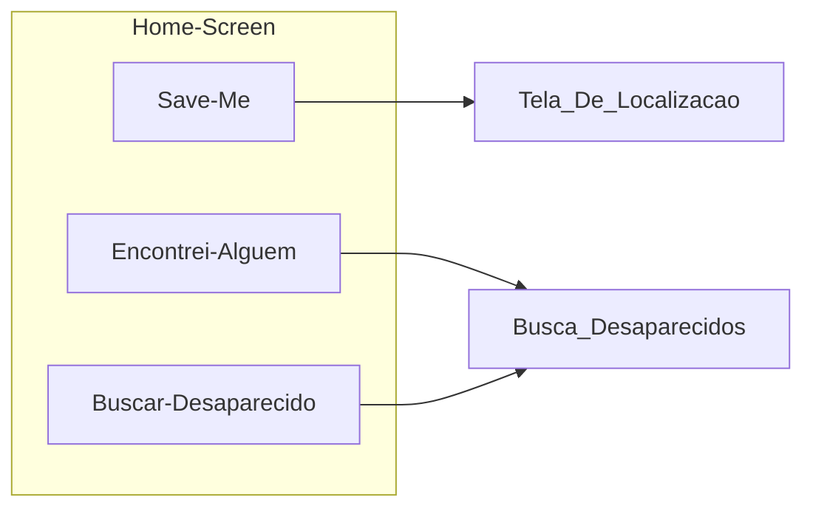

# Home screen
* Conterá :
  * O nome do App
  * Uma imagem com o logo do projeto
  * Botão "Me Salve!"
    * Funcionalidade para auto-cadastro de um desaparecido
    * É a funcionalidade principal do App
  * Botão "Encontrei Alguém"
    * Funcionalidade para avisar que encontrou uma pessoa
  * Botão "Buscar desaparecidos"
    * Funcionalidade para listar pessoas ainda com o status de desaparecidos
   
## Dúvidas
0. Deveríamos ter um PIX para doações para custear despesas de hospedagem?
1. Quais implicações fiscais de receber doações?

## Diagramas

